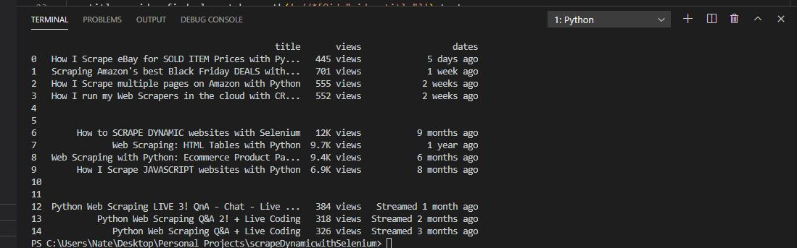

# DynamicWebScraping

This is a dynamic scraper that pulls data points from YouTube then exports them into a Data Frame using Pandas.  It was built using Selenium following a code along video I found <a href="https://www.youtube.com/watch?v=lTypMlVBFM4">here.</a>

 Cudos to the video creator John Watson Rooney, this project helped me a lot! 

